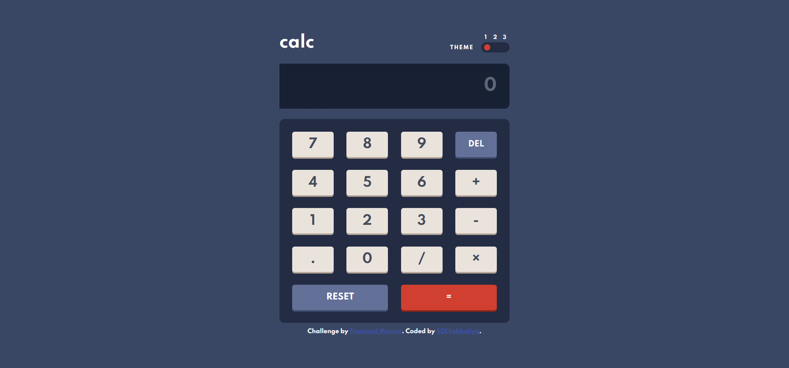
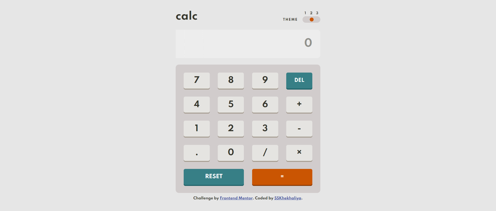
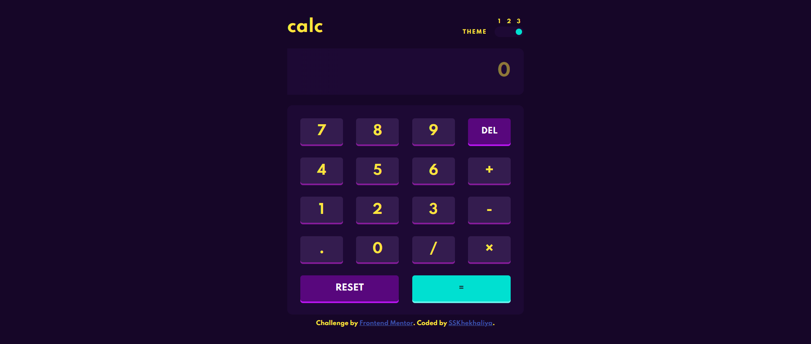

# Frontend Mentor - Calculator app solution

This is a solution to the [Calculator app challenge on Frontend Mentor](https://www.frontendmentor.io/challenges/calculator-app-9lteq5N29). Frontend Mentor challenges help you improve your coding skills by building realistic projects.

## Table of contents

- [Overview](#overview)
  - [The challenge](#the-challenge)
  - [Screenshot](#screenshot)
  - [Links](#links)
- [My process](#my-process)
  - [Built with](#built-with)
  - [Useful resources](#useful-resources)
- [Author](#author)
- [Acknowledgments](#acknowledgments)

## Overview

### The challenge

Users should be able to:

- See the size of the elements adjust based on their device's screen size
- Perform mathmatical operations like addition, subtraction, multiplication, and division
- Adjust the color theme based on their preference
- **Bonus**: Have their initial theme preference checked using `prefers-color-scheme` and have any additional changes saved in the browser

### Screenshot

### Links

- Solution URL: (https://github.com/sskhekhaliya/Frontend-Mentor--Calculator)
- Live Site URL: (https://sskhekhaliya.github.io/Frontend-Mentor--Calculator/)

## My process

### Built with

- CSS custom properties
- Flexbox
- CSS Grid
- [jQuery](https://jquery.com/) - JS library

### Useful resources

- [Stackoverflow](https://stackoverflow.com/) - This helped me whenever I stuck during code.
- [w3schools](https://www.w3schools.com/) - This site is really helpful for me all the time.

## Author

- Website - [SSKhekhaliya](https://www.sskhekhaliya.com)
- Frontend Mentor - [@sskhekhaliya](https://www.frontendmentor.io/profile/sskhekhaliya)
- Twitter - [@sskhekhaliya](https://www.twitter.com/sskhekhaliya)
- Instagram - [@sskhekhaliya](https://www.instagram.com/sskhekhaliya)
